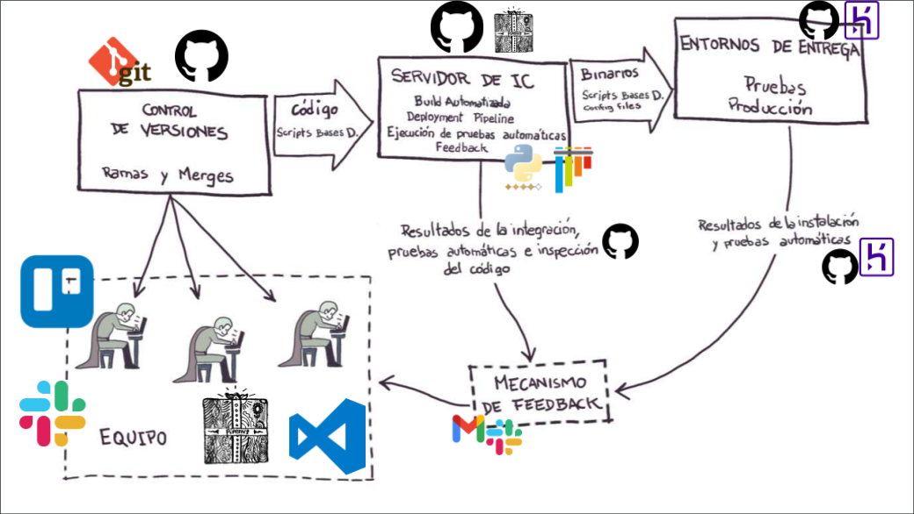

# Creating CI/CD Pipeline for Python Project using

# Continuos Integration - Enviroment - Resume

## About Continuous Integration

Continuous integration (CI) is a software practice that requires frequently committing code to a shared repository.

When you commit code to your repository, you can continuously build and test the code to make sure that the commit doesn't introduce errors. Your tests can include code linters (which check style formatting), security checks, code coverage, functional tests, and other custom checks.

Building and testing your code requires a server. You can build and test updates locally before pushing code to a repository, or you can use a CI server that checks for new code commits in a repository.

## About Continuous Deployment

Continuous deployment is a strategy for software releases wherein any code commit that passes the automated testing phase is automatically released into the production environment, making changes that are visible to the software's users.

## CI/CD Pipeline

## Using Github actions

> Actions are individual tasks that you can combine to create jobs and customize your workflow. You can create your own actions, and use and customize actions shared by the GitHub community.

Link: https://github.com/features/actions

GitHub offers CI workflow templates for a variety of languages and frameworks.

Browse the complete list of CI workflow templates offered by GitHub in the actions/starter-workflows repository.

Useful: https://help.github.com/en/actions/reference/workflow-syntax-for-github-actions